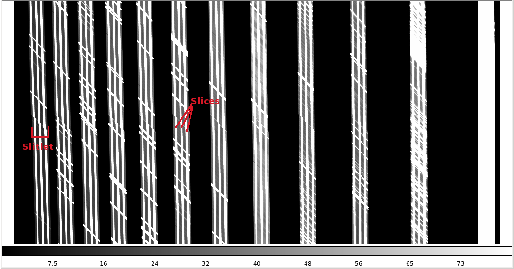
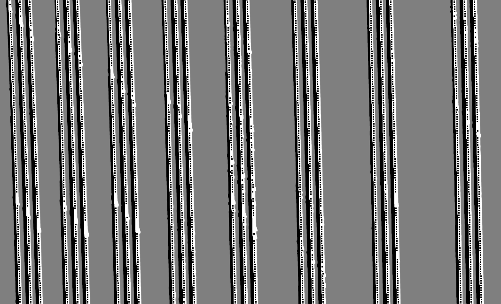

<p align="center"></p>

# MIRADAS guide

*[Docs home](README.md)*

MIRADAS is the near-IR multi-object, high-resolution IFU spectrograph for the GTC. This page explains how to reduce MIRADAS data with
superFATBOY; it is the [MIRADAS DRP](#about-the-drp) in its Python 3 form. It is also a good worked example of a slit-fed IFU
reduction, so it is worth reading even if you use another instrument.

- [About the DRP](#about-the-drp)
- [How the instrument maps onto the data](#how-the-instrument-maps-onto-the-data)
- [Calibration frames you need](#calibration-frames-you-need)
- [Quick start](#quick-start)
- [Observing modes compared](#observing-modes-compared)
- [The reduction, step by step](#the-reduction-step-by-step)
- [MIRADAS-specific processes](#miradas-specific-processes)
- [Output files](#output-files)
- [Tips and troubleshooting](#tips-and-troubleshooting)

## About the DRP

The MIRADAS data-reduction pipeline is **superFATBOY plus a set of MIRADAS recipes**. There is no separate program: you run
`superFatboy3.py` on an XML file, and the MIRADAS-specific steps are ordinary processes (`miradasCollapseSpaxels`, `miradasCreate3dDatacubes`, ...)
that you list in the XML alongside the general spectroscopic ones. Everything in the [quick start](quickstart.md), the
[XML guide](xml-guide.md) and the [spectroscopy processes](processes/spectroscopy.md) applies.

All three MIRADAS modes (SOL, SOS and MOS) have been run end-to-end on the Python 3 code in both GPU and CPU mode; see
[instruments](instruments.md).

## How the instrument maps onto the data

<p align="center"></p>

- A MIRADAS exposure is **vertically dispersed** and is read out on a detector mosaic, so each spectrum crosses two chips.
  That is why `n_segments` is 2 in several processes: each slitlet's transformation and wavelength solution are piecewise, with a break at the chip gap.
- The raw frame holds **12 slitlets** (SOL and MOS modes) or **13 slitlets** (SOS mode). A slitlet is a fixed position where light
  from one slit lands. Each slitlet is cut by an image slicer into **3 slices**, so a frame holds 36 (or 39) spectra.
- **SOL** (single-object long) and **SOS** (single-object short) put one object across all slitlets, each slitlet covering a different echelle
  *order*, so stitching the orders gives one long spectrum. **MOS** (multi-object) places a different target (from its own probe arm) in each slitlet, all at the same order.

## Calibration frames you need

| Calibration | Needed | How it is used |
|---|---|---|
| **Darks** | Yes | At the exposure times of your science frames and of your flats and lamps |
| **Flats** | Yes | Lamp on, or lamp on plus lamp off (tag with `flat_type`). Used to find the slitlets and to flat-field. |
| **Arclamps** | Yes | Lamp on, or on and off (`lamp_type`). Used to trace emission lines and calibrate wavelengths. |
| **Continuum source** | Optional | A bright continuum frame (for example a bright standard) to trace the continuum curvature if your data has none |
| **Distortion maps** | Optional | Pre-computed transformations (`xtrans_rect_file`, `ytrans_rect_file`) for the continuum and emission-line curvature. MIRADAS traces the same curvature for a given observing mode, so provided maps can replace tracing from your own data. |
| **Off-source skies** | Optional | If you nodded off the target for sky subtraction |
| **Bad pixel mask** | Optional | A `<calib type="bad_pixel_mask">`; otherwise one is computed from the master flat |

## Quick start

1. **Pick the template** for your mode and copy it:
   ```bash
   cp superFATBOY/data/templates/MIRADAS_SOL_template.xml my_data.xml     # or _SOS_ or _MOS_
   ```
2. **Describe your data** in `<queries>`:
   - `<dataset dir="/path/to/data" datatype="miradasSpectrum">`. **`datatype="miradasSpectrum"` is required**: it is what makes superFATBOY handle
     MIRADAS files (multiple ramps per exposure) correctly.
   - Every `<object>` and `<calib>` needs `<property name="dispersion" value="vertical"/>`.
   - MIRADAS filenames start with the index and then the date and instrument (`000055-20190101-MIRADAS-flat.fits`), so use `suffix` (or `prefix`
     for names like the test data) and `<index start="55" stop="70"/>`. Zero-padding is optional.
   - Give every calibration its `type` (`dark`, `flat`, `arclamp`, `sky`, `continuum_source`, `bad_pixel_mask`) and, for lamp on and off sets, the `flat_type` or `lamp_type` property.
   ```xml
   <calib name="flat" type="flat" suffix="20190101-MIRADAS-flat">
     <index start="000109" stop="000111"/>
     <property name="flat_type" value="lamp_on"/>
     <property name="dispersion" value="vertical"/>
   </calib>
   ```
3. **Set `<parameters>`:** `outputdir` (must exist), `gpumode` (`yes` only with an NVIDIA GPU and CuPy), and `memory_image_limit`.
   Keyword names are already set correctly in the template (`GAIN_1`, `RDNOIS_1`, `GRATNAME`, `FILTNAME`, `OBJECT`).
4. **Point at the right wavelength-calibration file** in `wavelengthCalibrate` (`wavelength_calibration_file`); see [below](#wavelengthcalibrate).
5. **Tune** `write_output` and `write_calib_output` to taste, and set the sky method (`dither` for on-source A-B dithers, `offsource_dither` for off-source).
6. **Run:** `superFatboy3.py my_data.xml`. A run of a full dataset takes 15 to 25 minutes.

## Observing modes compared

The three templates differ in only a handful of places; everything else is shared.

| | SOL | SOS | MOS |
|---|---|---|---|
| Slitlets (`slitlet_autodetect_nslits`) | 12 | 13 | 12 |
| Spectra in `extractSpectra` (`extract_nspec`) | 3 per slitlet | 3 per slitlet | 3 per slitlet |
| `findSlitlets` `n_segments` | 2 | (as SOL) | 1 (default) |
| `continuum_find_xlo`/`xhi` | 1725 / 1875 | 1700 / 1900 | 1700 / 1900 |
| Wavelength-calibration file | `wc_miradas_sol*.xml` | `wc_miradas_sos*.xml` | `wc_miradas_mos_NN.xml`, one per order NN |
| `resample_to_common_scale` | `no` | `no` | `yes` |
| `miradasCollapseSpaxels` box | full | full | `box_lo` = 1000, `box_hi` = 3000 (low illumination at top and bottom) |
| Order stitching (`miradasStitchOrders`) | yes | yes | no (single order) |

## The reduction, step by step

This is the chain in the SOL template. The numbers are the values the templates use, which were tuned on simulated and real MIRADAS data; the
templates carry comments explaining each one. For what each general process does in detail, follow the links.

| Step | Process | What happens, and the MIRADAS-relevant settings |
|---|---|---|
| 1 | [`linearity`](processes/imaging.md#linearity) | Detector linearity polynomial. The template has `linearity_coeffs = 1` (no change); put in real coefficients when you have them. |
| 2 | [`noisemap`](processes/spectroscopy.md#noisemap) | Creates the noise image carried through every later step. |
| 3 | [`darkSubtract`](processes/imaging.md#darksubtract) | Master dark per exposure time, subtracted from everything. `prompt_for_missing_dark = no`. |
| 4 | [`createCleanSkies`](processes/spectroscopy.md#createcleanskies) | Median (`combine_method = min` in the templates) of dark-subtracted frames. |
| 5 | [`createMasterArclamps`](processes/spectroscopy.md#createmasterarclamps) | Master arclamp. |
| 6 | [`findSlitlets`](processes/spectroscopy.md#findslitlets) | Finds the 12 (13) slitlets from the flat and traces them. `slitlet_autodetect_x = 1600`, `slitlet_autodetect_nslits = 12` (13 for SOS), `fit_order = 3`, `n_segments = 2`, `padding = 2`, `boundary = 100`, `slitlet_trace_boxsize = 51`, `trace_slitlets_individually = yes`, `edge_extend_to_chip = yes`, `cut1d_max_threshold = 1.5`. |
| 7 | [`cosmicRaysSpec`](processes/spectroscopy.md#cosmicraysspec) | `dcr`, `cosmic_ray_method = mask`. Vertical dispersion needs `dcr_disp_axis = 2` if you change the algorithm. |
| 8 | [`flatDivideSpec`](processes/spectroscopy.md#flatdividespec) | Flat field, normalized slitlet by slitlet. |
| 9 | [`badPixelMaskSpec`](processes/spectroscopy.md#badpixelmaskspec) | Mask from a file or from the flat (`clipping_high`/`clipping_low`); `behavior = interpolate`, `median_neighbor`. |
| 10 | [`skySubtractSpec`](processes/spectroscopy.md#skysubtractspec) | `sky_method = dither` (on-source AB or ABBA) or `offsource_dither`. |
| 11 | [`rectify`](processes/spectroscopy.md#rectify) | Straightens continua and lines slitlet by slitlet. See the settings below. |
| 12 | [`miradasCollapseSpaxels`](#miradascollapsespaxels) | Collapses each slice to a 3-spaxel by N image and centroids it. |
| 13 | [`miradasCreate3dDatacubes`](#miradascreate3ddatacubes) | 3-d datacube per slitlet. |
| 14 | [`doubleSubtract`](processes/spectroscopy.md#doublesubtract) | Combines the positive and negative spectra of on-source A-B pairs. |
| 15 | [`shiftAdd`](processes/spectroscopy.md#shiftadd) | Shifts and adds frames. |
| 16 | [`wavelengthCalibrate`](#wavelengthcalibrate) | Per-slitlet, piecewise wavelength solutions. |
| 17 | [`miradasCharacterizePSF`](#miradascharacterizepsf) | PSF versus wavelength from the datacube. |
| 18 | [`extractSpectra`](processes/spectroscopy.md#extractspectra) | 1-d spectra: a row-stacked-spectra (RSS) file with 36 rows (SOL, MOS) or 39 (SOS). |
| 19 | [`miradasCombineSlices`](#miradascombineslices) | Combines the 3 slices of each slitlet into one spectrum. |
| 20 | [`miradasStitchOrders`](#miradasstitchorders) | (SOL and SOS) Stitches the orders into one spectrum. |

### Settings for `rectify`

MIRADAS orders are strongly curved, so `rectify` needs non-default settings. These come from the templates:

| Option | Value | Why |
|---|---|---|
| `mos_mode` | `independent_slitlets` | Curvature differs between slitlets, so each is fitted separately. **Required.** |
| `n_segments` | `2` | Two detector chips |
| `mos_fit_order` | `3` (an earlier guide recommended 4) | Continuum fit order |
| `mos_sky_fit_order` | `3` (earlier guide: 4) | Line fit order |
| `use_arclamps` | `yes` | Trace emission lines in the master arclamp |
| `max_continua_per_slit` | `3` | One continuum per slice |
| `min_threshold` | `4` | Continuum detection threshold |
| `continuum_find_xlo`, `continuum_find_xhi`, `continuum_trace_xinit` | 1725, 1875, 1800 (SOL) | A narrow range of columns in which to find continua, and where to start tracing. Highly curved orders need a narrow range. |
| `mos_find_lines_alternate_method` | `yes` | Needed for extremely curved slits |
| `mos_sky_step_size`, `sky_boxsize`, `sky_max_slope` | 2, 10, 0.6 | Step size, box and slope limit for line tracing |
| `drihizzle_kernel`, `drihizzle_dropsize` | `turbo`, 1 | Drizzle kernel |

You can avoid tracing continua from your own data entirely by supplying distortion maps (`xtrans_rect_file`, `ytrans_rect_file`), since MIRADAS
curvature is constant for a given mode. If you trace, consider `independent_slitlets_fallback = nearest_neighbor_slits`, which lets a slitlet with no continuum borrow a fit from
its neighbours instead of being left un-rectified (see [rectify](processes/spectroscopy.md#rectify)).

<p align="center"><br>
<em>QA image from continuum tracing: a box marks each point that was successfully traced and used in the fit of <code>x_out = f(x_in, y_in)</code>.</em></p>

### `wavelengthCalibrate`

MIRADAS ships line lists and per-slitlet starting guesses. In the templates:

- `line_list = Redman_UArNe_lines.dat` (in `superFATBOY/data/linelists/`)
- `use_arclamps = yes`, `calibrate_slitlets_individually = yes`, `fit_order = 3`, `use_initial_guess_on_fail = yes`
- `wavelength_calibration_file` names an XML file in `superFATBOY/data/config/` with each slitlet's and segment's wavelength range and starting scale:

  | Mode | Files in `data/config/` |
  |---|---|
  | SOL | `wc_miradas_sol.xml` |
  | SOS | `wc_miradas_sos.xml` (`wc_miradas_sos_real.xml` and the `_rev` variants are alternatives) |
  | MOS | `wc_miradas_mos_NN.xml`, where NN is the echelle order (14 to 34) |

- SOL and SOS: `resample_to_common_scale = no`. MOS: `yes`, plus `n_brightest_lines = 14` and `max_bright_line_separation = 1000`.

## MIRADAS-specific processes

All MIRADAS processes accept `write_output` and `write_calib_output`. Many take `slitlet_number`: `all` (default) or a number 1 to 13 to work on one slitlet only, which is useful for debugging.

### miradasCollapseSpaxels

Collapses each slice of every slitlet along the dispersion direction to a **monochromatic 3 by N** image (3 spaxels across, N along the slice), which can then be used to
find PSFs. It can also centroid those images.

<p align="center"><br>
<em>A collapsed slitlet: three rows of spaxels.</em></p>

| Option | Default | Meaning |
|---|---|---|
| `nslices` | `3` | Slices per slitlet |
| `slice_width` | `auto` | Slice width in pixels, or `auto` |
| `do_centroids` | `yes` | Centroid the collapsed images |
| `centroid_method` | `fit_2d_gaussian` | `fit_2d_gaussian` or `use_derivatives` (the templates use `use_derivatives`) |
| `use_integer_shifts` | `no` | `yes` shifts by whole pixels and does not resample |
| `max_shift_between_slices` | `4` | Largest shift allowed between any slice and the mean centre |
| `box_lo`, `box_hi` | `None` | Bounds, along the dispersion axis, of where the arclamp has data (MOS template: 1000 and 3000) |
| `pad_images_to_same_size` | `yes` | Pad slitlet images to a common size |
| `slitlet_number` | `all` | One slitlet or all |

### miradasCreate3dDatacubes

Builds a 3-d datacube for each slitlet, where each *cut* is a monochromatic 3 by N image at one wavelength, using the spaxel shifts from the collapse step. The cube is roughly 3 by N by
4000 (N about 26). In the templates it runs right after `rectify` and `miradasCollapseSpaxels`. The options match
`miradasCollapseSpaxels`, plus:

| Option | Default | Meaning |
|---|---|---|
| `apply_dar_correction` | `yes` | Apply a differential-atmospheric-refraction correction *if one already exists* for the frame (see [DAR](#miradasdarfromconditions-and-miradasdarfromdata)); otherwise nothing is applied |
| `drihizzle_kernel`, `drihizzle_dropsize` | `turbo`, `1` | Drizzle kernel |

### miradasCharacterizePSF

Traces and characterizes the PSF at each cut through the datacube (after wavelength calibration). For each wavelength it records the wavelength, x and y centroid, FWHM, peak value, median value and standard deviation.
If no source is detected the centroid, FWHM and peak are set to `-1` as a flag.

| Option | Default | Meaning |
|---|---|---|
| `detection_threshold` | `2` | Minimum significance above the median to call something a source |
| `centroid_method` | `fit_2d_gaussian` | `fit_2d_gaussian` or `use_derivatives` |
| `slitlet_number` | `all` | One slitlet or all |

### miradasCombineSlices

Combines the three slices of each slitlet into a single 1-d spectrum. It first corrects for **relative slice illumination** by collapsing each slice into a total flux value to get weights, then combines
using the weights and the propagated noisemaps.

| Option | Default | Meaning |
|---|---|---|
| `slice_weighting` | `none` | `none`, `normalize_flux`, `flux_weighted` or `noisemap_only` |
| `slices_per_slitlet` | `0` | A nonzero number overrides the header; 0 takes it from the header or from a slitlet list calib |

### miradasStitchOrders

SOL and SOS only. Stitches the 1-d wavelength-calibrated spectra of all slitlets (orders) into one. It first corrects for relative slitlet illumination, using the
median of each slitlet in the master flat to get weights, and resamples to a common wavelength scale with linear interpolation.

| Option | Default | Meaning |
|---|---|---|
| `order_weighting` | `none` | `none`, `normalize_flux`, `flux_weighted` or `noisemap_only` |

### miradasDARFromConditions and miradasDARFromData

Differential atmospheric refraction shifts the image position of an object with wavelength. Two processes estimate it. Both need wavelengths, so they belong after
`wavelengthCalibrate`. Neither is in the shipped templates, so add one if you need DAR; `miradasCreate3dDatacubes` applies a DAR correction only if one exists for the frame when it runs.

- **`miradasDARFromConditions`** computes the expected DAR as a function of wavelength from the site conditions (the Filippenko 1982 formula) using pressure, temperature,
  water-vapour pressure, the zenith angle of the object and the 0.16 arcsec per pixel scale.
- **`miradasDARFromData`** measures DAR from the centroid position of a point-like source versus wavelength. It needs the airmass in the header.

Both take `slitlet_number` (`all` by default). Output: `DAR/`.

### miradasRegisterWCS

Registers the world-coordinate system for each slitlet from the probe-arm pointing. The RA and Dec of the corresponding probe arm are read from the header and copied into new
per-slitlet keywords `RA_Sxx` and `DEC_Sxx` (xx = 01 to 13). In SOL and SOS modes one probe arm is used for all slitlets; in MOS mode each slitlet has its own.

| Option | Default | Meaning |
|---|---|---|
| `single_object_probe_arm` | `5` | The probe arm used in SOL and SOS modes |
| `mos_slitlet_1_probe_arm` | `1` | The probe arm for slitlet 1 in MOS mode |

Output: `registeredWCS/rwcs_*.fits`.

## Output files

With `write_output = yes` on the MIRADAS processes you get, among others:

| Directory | Contents |
|---|---|
| `findSlitlets/` | The slitmask, region files, QA images and `stats_*` diagnostics |
| `rectified/` | The rectified frames, continuum and line traces, QA images and `stats_*` diagnostics |
| `collapsedSpaxels/cs_*` | Collapsed 3-spaxel images |
| `3dDatacubes/` | Datacubes |
| `characterizedPSFs/psf_*` | PSF tables versus wavelength |
| `wavelengthCalibrated/wc_*` | Wavelength-calibrated frames, QA plots (`write_plots`) |
| `extractedSpectra/es_*` | RSS files: one row per spectrum (36 or 39) |
| `combinedSlices/cs_*` | One spectrum per slitlet |
| `stitchedOrders/so_*` | The final stitched spectrum (SOL, SOS) |
| `DAR/`, `registeredWCS/` | DAR corrections and WCS registration output |

## Tips and troubleshooting

- **Set the dispersion on everything.** A missing `dispersion = vertical` on a single `<calib>` makes superFATBOY treat it as horizontally dispersed, and later steps will not find a match.
- **`findSlitlets` reports the wrong number of slitlets.** Check `slitlet_autodetect_x` (a column where the flat is brightly and evenly illuminated) and lower
  `slitlet_autodetect_sigma` or `slitlet_autodetect_min_trough_depth` if slitlets are faint or packed. The expected count is a check, so a mismatch is reported rather than hidden.
- **A slitlet is skipped or poorly rectified.** Look at `rectified/stats_*.txt` to see how many trace points were rejected and for what reason, and at the QA images. Try
  `independent_slitlets_fallback = nearest_neighbor_slits`, or supply distortion maps.
- **`Could not match 3 brightest lines ... Skipping order!`** during `wavelengthCalibrate`: one order had too few lines. This is normal for faint orders. If it is *every* order, the
  wavelength file or scale guess does not match your grating setting.
- **GPU versus CPU.** Results agree to floating-point rounding. If you suspect a GPU problem, run the same XML with `gpumode = no` and compare.
- **Never leave `debug_mode = yes` in an unattended run.** It opens interactive plot windows. Use `write_plots = yes` for PNGs instead.
- **Reruns reuse output.** To force a step to recompute, delete its output sub-directory or set `overwrite_files = yes`.
