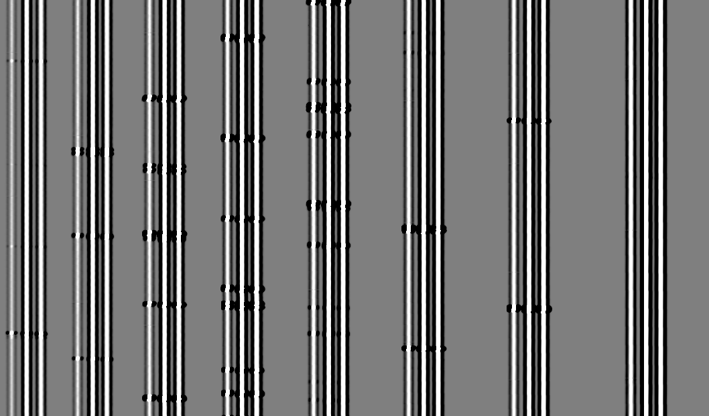

<p align="center"></p>

# Spectroscopy processes

*[Docs home](../README.md) · [Process guide](README.md) · [Imaging processes](imaging.md)*

These processes reduce longslit, multi-object (MOS) and slitlet-based IFU spectra. They are validated on FLAMINGOS-1 MOS,
OSIRIS longslit, KAST longslit and MIRADAS (see [instruments](../instruments.md)). Typical orders:

```
Longslit:  noisemap → biasSubtract → createMasterArclamps → cosmicRaysSpec → flatDivideSpec → skySubtractSpec
             → rectify → shiftAdd → wavelengthCalibrate → extractSpectra → calibStarDivide

MOS:       linearity → noisemap → darkSubtract → createCleanSkies → createMasterArclamps → findSlitlets
             → cosmicRaysSpec → flatDivideSpec → badPixelMaskSpec → skySubtractSpec → rectify → doubleSubtract
             → shiftAdd → wavelengthCalibrate → extractSpectra → calibStarDivide
```

[`linearity`](imaging.md#linearity), [`darkSubtract`](imaging.md#darksubtract) and [`biasSubtract`](imaging.md#biassubtract)
are shared with imaging. All of the processes on this page need two pieces of information on the frames, which you supply as
[`<property>` tags](../xml-guide.md#children-of-object-and-calib) in `<queries>`: `specmode` (`longslit`, `ifu`, or anything else
meaning MOS) and `dispersion` (`horizontal`, the default, or `vertical`).

## Terms used below

- **Slitlet**: a slit in a MOS mask, a slicer slice-group in an IFU, or (for longslit) the whole slit. A **slitmask** is a 2-d image the size of the detector in which every
  pixel inside slitlet *n* has the value *n* and everything else is 0. Many processes use it to work on one slitlet at a time.
- **Clean sky**: a median of all the dark-subtracted frames of a dataset. The object continua median away and the sky lines remain, so it is an excellent image for finding sky lines.
- **Rectified**: geometrically resampled so that continua run exactly along rows and sky or arc lines run exactly along columns (or the reverse, for vertical dispersion).
- **Noisemap**: a per-pixel uncertainty image created once by `noisemap` and then carried through every later step (added in quadrature when frames are subtracted, resampled when frames are rectified, and so on).

- [noisemap](#noisemap)
- [createCleanSkies](#createcleanskies)
- [createMasterArclamps](#createmasterarclamps)
- [findSlitlets](#findslitlets)
- [cosmicRaysSpec](#cosmicraysspec)
- [flatDivideSpec](#flatdividespec)
- [badPixelMaskSpec](#badpixelmaskspec)
- [skySubtractSpec](#skysubtractspec)
- [rectify](#rectify)
- [doubleSubtract](#doublesubtract)
- [shiftAdd](#shiftadd)
- [slitletAlign](#slitletalign)
- [wavelengthCalibrate](#wavelengthcalibrate)
- [resample](#resample)
- [extractSpectra](#extractspectra)
- [calibStarDivide](#calibstardivide)

---

## noisemap

Creates a noise image from the (linearized) data: `noise = sqrt(counts / gain)`. From then on the noisemap is propagated through every process, so the final spectra carry proper
uncertainties. After `noisemap`, every later process gains a `write_noisemaps` option to save its noisemap alongside its output.

The gain is read from the header (`gain_keyword`); if it is missing the gain defaults to 1 with a warning, and the absolute noise values will be wrong. It has no options of its own.

## createCleanSkies

Median-combines the dark-subtracted frames of each dataset into a "clean sky", the image later used to find sky lines for rectification and wavelength calibration. Combining many
frames suppresses the target and improves signal-to-noise, so skylines are found even in short exposures. It is cleaner than using a single, flat-fielded frame because flat-fielding adds noise.

| Option | Default | Meaning |
|---|---|---|
| `combine_method` | `median` | `median`, `quartile` or `min`. `quartile` rejects the brightest half of the frames at each pixel and takes the median of the rest (the lower quartile), which suppresses continua that land on a pixel in some frames; `min` takes the faintest frame and helps when a bright continuum is present in every frame (MIRADAS uses it). GPU and CPU give identical results (since 2.3.45). |
| `max_frames_to_combine` | `10` | Combine at most this many frames |
| `default_master_clean_sky` | `None` | Use this file instead |

Output: `cleanSkies/` with `write_calib_output`. The rectify and wavelengthCalibrate steps use it unless you set `use_arclamps = yes`.

## createMasterArclamps

Combines arclamp frames (`<calib type="arclamp">`) into a master arclamp, used by `rectify` and `wavelengthCalibrate` when `use_arclamps = yes`. This is the usual choice when
your sky has few lines (short exposures, or optical data, where the sky is not line-rich) or the target has a bright continuum.

| Option | Default | Meaning |
|---|---|---|
| `lamp_method` | `lamp_on` | `lamp_on`, or `lamp_on-off` (subtract a lamp-off frame to remove the background). For `lamp_on-off`, mark the frames with `<property name="lamp_type" value="lamp_on"/>` or `lamp_off`. |
| `lamp_off_files`, `lamp_off_header_value` | `off`, `OFF` | Alternative ways to identify lamp-off frames: a filename fragment, an ASCII file, or a FITS keyword and value |
| `default_master_arclamp` | `None` | Use this master arclamp file (or list). Selected by filter and grating. |

Output: `masterArclamps/` with `write_calib_output`.

## findSlitlets

Finds every slitlet (or fibre) on the detector, traces the top and bottom edge of each across the detector, and builds the **slitmask**.
It uses the master flat, and if none exists yet it asks `flatDivideSpec` to build one. The slitmask is used by nearly everything after it.

How it works: it takes a 1-d cut across the flat in the cross-dispersion direction, finds the slitlets in it (they appear as plateaus
separated by gaps), then steps along the dispersion direction, finding each edge at each step and fitting a smooth curve through
the points. With `trace_slitlets_individually = yes`, each slitlet has its own fit (needed when the curvature varies between slitlets, as in echelle and MIRADAS data); otherwise one group
fit is used for all.

**Where slitlets come from:** automatically (set `slitlet_autodetect_x` to a column where the flat is well illuminated, and `slitlet_autodetect_nslits` to the number you
expect as a check) or from a region file given with `region_file` (DS9 `.reg`, `.xml` or `.txt`).

Auto-detection normally uses the flat. If closely packed slitlets merge together because the flat barely dips between them, set
`slitlet_autodetect_source` to `both`. It then uses the master arclamp: rows of one slitlet all share the same arc line pattern, so
the boundary between two slitlets shows up clearly, as long as they are offset in wavelength. The master arclamp is found or created on
the fly (`createMasterArclamps` must be in the XML).

**Invalid slitlets.** Illuminated regions that are not real slitlets, such as the mask ID strip at the top of LUCI masks, are flagged.
Their flat is rough from row to row and their arc rows don't share one spectrum. Auto-detected ones are dropped with an `ERROR` in the log.
Ones listed in a region file are kept, but a `WARNING` is logged.

| Option | Default | Meaning |
|---|---|---|
| `slitlet_autodetect_source` | `flat` | `flat`, `arclamp`, or `both`. `both` takes slitlets and packed boundaries from the arclamp and refines outer edges with the flat; `arclamp` alone has slightly wide outer edges. Correlates over the whole dispersion range, so is a poor fit for strongly curved data such as MIRADAS. If `slitlet_autodetect_nslits` is set and the arclamp gives the wrong count while the flat gives the right one, it falls back to the flat with an `ERROR` in the log. |
| `slitlet_autodetect_arc_min_corr` | `0.9` | Minimum correlation between adjacent arclamp rows for them to be in the same slitlet |
| `slitlet_validity_max_flat_roughness` | `0.045` | Flag a slitlet whose flat varies from row to row by more than this fraction of its flux (0 = off). Real slitlets on LUCI and MIRADAS score 0.001 to 0.024; the LUCI mask ID scores 0.09. |
| `slitlet_validity_min_arc_corr` | `0.9` | With an arclamp in use, flag a slitlet whose arc rows correlate less than this on average (0 = off) |

| Option | Default | Meaning |
|---|---|---|
| `slitlet_autodetect_x` | `1024` | Column (along dispersion) at which to take the 1-d cut that finds slitlets |
| `slitlet_autodetect_nslits` | `0` | How many slitlets you expect; superFATBOY reports an error if it finds a different number (0 = no check) |
| `region_file` | `None` | Use slitlet positions from a file instead of autodetecting |
| `fit_order` | `2` | Polynomial order for each edge. 2 for individual tracing is typical, 3 for group mode; MIRADAS uses 3 to 4. |
| `trace_slitlets_individually` | `yes` | One fit per slitlet (`yes`) or one shared fit (`no`) |
| `n_segments` | `1` | Fit piecewise functions; 2 for MIRADAS, whose detector is two chips |
| `padding` | `0` | Widen each slitlet by this many pixels (MIRADAS: 2) |
| `boundary` | `10` | Don't trace within this many pixels of a segment's edge (MIRADAS: 100) |
| `min_coverage_fraction` | `30` | A traced edge must cover at least this percentage of the slitlet to be used |
| `max_residual_error` | `2.0` | Reject a fit whose residual scatter is bigger than this |
| `slitlet_trace_boxsize` | `21` | Width of the cut used for tracing in individual mode (MIRADAS: 51) |
| `edge_extend_to_chip` | `no` | If one edge runs off the chip, extend the other rather than clipping it |
| `write_plots` | `no` | Save QA plots as PNG |

**Closely-packed slitlets.** Where adjacent slitlets are separated by a genuine gap, the default edge detector (cross-correlation) works well. When they sit right
next to each other and the boundary is only a shallow dip, it can find nothing for that edge. The default `auto` handles this:

| Option | Default | Meaning |
|---|---|---|
| `edge_detection_method` | `auto` | `cross_correlation`, `local_minimum`, or `auto`. `auto` tries cross-correlation first for each edge and only falls back to the local-minimum finder for an edge where cross-correlation finds no points at all, so it gives exactly the same result as `cross_correlation` on any edge that method can trace. `local_minimum` on its own regresses on genuine step edges. |
| `narrow_gaps_between_slitlets` | `no` | With `yes`, a point on an edge where both sides of the cut are lit (a packed boundary) is measured with the local-minimum finder instead of being rejected. Unlike `auto`, this switches point by point, so it also handles an edge that is a clean step along part of the slit and packed along the rest. |
| `slitlet_autodetect_min_trough_depth` | `0.3` | When splitting packed slitlets during auto-detection: minimum depth of the trough between two slitlets, as a fraction of the fainter slitlet's height. Lower (for example 0.1) for very shallow boundaries. |
| `local_min_depth_threshold` | `0.05` | For `local_minimum`: minimum dip depth to accept a point |
| `local_min_search_radius` | `3` | For `local_minimum`: once the trace has a point, only look for the minimum within this many pixels of the predicted position, and reject the point if there is no dip there. This stops the trace wandering onto a fainter neighbouring slitlet where a packed boundary turns into a plain step. |
| `fit_function` | `polynomial` | `polynomial` or `spline`. At the low fit orders normally used here the two are numerically identical; `spline` helps only when you raise the order. |
| `spline_smoothing` | `-1` | Smoothing for `spline` (`-1` = scipy's default, `0` = interpolate exactly) |

**Fibres.** For fibre-fed data such as MEGARA, `autodetect_peak_local_max`, `trace_peak_local_max` and `fiber_width` switch to a peak-finding approach.

**Robustness.** If one slitlet cannot be traced (a fit failure or poor coverage), it is given a straight edge and the rest of the frame is kept; the whole image is only discarded if every slitlet
failed. With `write_calib_output = yes`, a `stats_<flat>.txt` file in `findSlitlets/` lists every traced point and why it was kept or rejected, and `qa_*` images show the result.

Output: `findSlitlets/slitmask_*.fits` (with `write_calib_output`) and region files. The slitmask is also stored as a calibration for later processes.

## cosmicRaysSpec

Removes cosmic rays from spectroscopic frames. For MOS and IFU data, the algorithms are run slitlet by slitlet (skylines are at different positions in different slitlets)
unless you set `mos_use_whole_chip = yes`.

| `cosmic_ray_algorithm` | How it works |
|---|---|
| `dcr` *(default)* | Histograms of small postage-stamp sub-images (the DCR algorithm of Wojtek Pych, wrapped from C) |
| `lacos` | L.A. Cosmic (van Dokkum): Laplacian edge detection, translated to Python from the IRAF original |
| `deepcr` | A deep neural network; needs `deepCR`. The default models were trained on HST imaging, so check the results on your data. |

| Option | Default | Meaning |
|---|---|---|
| `cosmic_ray_method` | `mask` | `mask` (flag the pixels; masked pixels are excluded later) or `replace` (fill in an estimate) |
| `dcr_disp_axis` | `1` | `0` no dispersion, `1` horizontal (X), `2` vertical (Y). **Set to 2 for vertically dispersed data** (MIRADAS, KAST red). |
| `dcr_threshold` | `4.0` | Detection threshold in standard deviations |
| `dcr_npass` | `5` | Maximum number of cleaning passes |
| `dcr_xradius`, `dcr_yradius` | `9`, `9` | Half-size of the statistics box |
| `dcr_grow_radius` | `1` | Grow each detected cosmic ray by this many pixels |
| `lacos_cosmic_ray_sigma` | `10` | L.A. Cosmic detection threshold |
| `lacos_cosmic_ray_passes` | `1` | Number of passes |
| `lacos_xorder`, `lacos_yorder` | `-1` | Fit orders (`-1` = smooth rather than fit and subtract) |
| `remove_stray_light` | `no` | Also remove round stray-light artifacts (KAST red); needs `sep` |
| `mos_use_whole_chip` | `no` | Run the algorithm on the whole chip instead of slitlet by slitlet |

For each algorithm there are several more tuning options (`deepcr_*`, `stray_light_*`, `dcr_lower_radius`, ...); see the [reference](../options-reference.md#cosmicraysspec).

**L.A. Cosmic notes.** It follows `lacos_spec.cl`: object spectra are fitted along the dispersion direction and sky lines along the slit, then
removed before the Laplacian search, and added back once at the end. For vertically dispersed data each slitlet is transposed first, so the fits
always run along the right axes. In MOS mode each slitlet is processed in its bounding box; pixels of the box outside the slitlet are filled
with the nearest in-slit value rather than zero, so slitlet edges are not mistaken for cosmic rays.
The noisemap is left untouched by cosmic ray removal, so it can be used to find where rays were.

## flatDivideSpec

Builds a master flat, **normalizes it slitlet by slitlet** (so every slitlet has unit median even though some are brighter than others), and divides the science frames by it. It uses
the slitmask from `findSlitlets`, building it on demand if the slitmask does not exist yet.

Sky lines are found in the *clean sky* (or master arclamp), which is built from frames that have not been flat-fielded, so the extra noise flat-fielding adds near the detector edges never
reaches the line-finding steps.

| Option | Default | Meaning |
|---|---|---|
| `flat_method` | `dome_on` | `dome_on`, or `dome_on-off` with `flat_type` properties on the flats |
| `normalize_flat` | `yes` | Normalize within each slitlet |
| `flat_selection` | `all` | `all` flats for the filter/grating, or `object_keyword` to use only flats with a matching object name |
| `flat_low_thresh`, `flat_low_replace`, `flat_hi_thresh`, `flat_hi_replace` | `0`, `1`, `0`, `1` | After normalizing, replace pixels below or above the threshold with the replacement value (0 = off) |
| `prompt_for_missing_flat` | `yes` | If there is no matching flat, ask for a file. **Set to `no` for unattended runs**, or comment the process out entirely if you have no flats. |
| `default_master_flat` | `None` | Use this master flat |

## badPixelMaskSpec

Builds and applies a bad pixel mask for spectroscopic data. The options for building the mask are the same as for
[`badPixelMask`](imaging.md#badpixelmask) (from the flat by threshold, from a source file by threshold or sigma, from `<calib type="bad_pixel_mask">`, or named in `default_bad_pixel_mask`). Unlike
imaging, spectroscopy can **interpolate** over bad pixels, since there is typically only one exposure per slit position.

| Option | Default | Meaning |
|---|---|---|
| `behavior` | `mask` | `mask` (just flag; use when you will shift and add several frames) or `interpolate` (fill in; use when reducing a single A-B pair) |
| `interpolation_algorithm` | `median_neighbor` | `median_neighbor`, `linear_1d_x`, `linear_1d_y`, `linear_2d`, `linear_spline`, `cubic_spline`, `quintic_spline`, `weighted`, `biharmonic_2d` |
| `interpolation_iterations` | `1` | Maximum iterations for algorithms that iterate |
| `interpolation_arg` | `None` | Extra argument specific to the algorithm |
| `use_individual_slitlets` | `yes` | Normalize each slitlet individually when building the mask from the flat |
| `normalize_source` | `yes` | Normalize the source before applying `clipping_high` and `clipping_low` |

## skySubtractSpec

Subtracts the sky. The right `sky_method` depends on how you observed. Spectroscopic sky subtraction normally pairs frames (A-B) so that the sky lines and
detector background cancel, which also gives you a negative spectrum to be combined later by [`doubleSubtract`](#doublesubtract).

| `sky_method` | Observing pattern | What happens |
|---|---|---|
| `dither` *(default)* | Any on-source dither pattern (A-B, A-B-C, ABBA, AABB, ...) | Each frame is paired with the next frame (in time order) at a *different* position (at least `sky_dithering_range` arcsec away in RA or Dec) and subtracted. You end up with half as many frames, each with one positive and one negative spectrum. |
| `ifu_onsource_dither` | On-source dither, IFU data | As `dither`, but each pair yields *both* A-B and B-A and neither is double-subtracted, so you keep both observations |
| `step` | Stepping along the slit (every frame at a new position) | Even number of frames: pairs 1-2, 3-4, ... (double subtracted later). Odd number: 1-2, 2-3, ..., n-1 (same count as inputs, not double subtracted). |
| `offsource_dither` | Sky frames observed off-source (ABBA or ABAB with B = sky) | Each object frame is paired with the off-source sky nearest in time, without reusing a sky frame. Add the skies as `<calib type="sky">`. |
| `offsource_multi_dither` | Several short exposures at each position (AAAABBBB...) | Each group of short on-source frames is median combined, as is each group of short sky frames, then combined A minus combined B |
| `median` | Many frames of one target | The median of the other frames of the same target, scaled, is subtracted. Frame count is preserved. |
| `median_boxcar` | Longslit | A running median along the slit is used as the sky |

| Option | Default | Meaning |
|---|---|---|
| `sky_dithering_range` | `2` | Minimum separation, in arcsec, for two frames to count as different dither positions |
| `ignore_odd_frames` | `yes` | With an odd number of frames, discard the extra frame (`yes`) or subtract it from a frame used twice (`no`) |
| `double_subtract_odd_frames` | `no` | Whether a re-used odd frame is double subtracted (recommended: `no`) |
| `onsource_sorting_key` | `full` | How to order frames in time: `full` (string sort of the identifier), `index` (numeric sort of the index, correct when indices are not zero-padded), or a FITS keyword such as `MJD` (needed if the index resets, for example at midnight UTC) |
| `sky_offsource_method` | `auto` | `auto` assumes the first frame is on-source and takes any frame more than `sky_offsource_range` arcsec away as a sky; or give a 6-column ASCII file: `object_prefix start stop sky_prefix start stop` |
| `sky_offsource_range` | `240` | Offset in arcsec, for `auto` |
| `offsource_multi_dither_ncombine` | `0` | Short frames per position (0 = detect automatically) |
| `remove_residuals`, `residual_removal_method` | `no`, `median_boxcar` | Try to remove sky-subtraction residuals afterwards (`median_boxcar` or `response_curve`) |
| `default_master_sky` | `None` | Use this master sky |

The dither methods pair frames by their RA/Dec offsets, so every frame needs a position: the header keywords listed in `ra_keyword` /
`dec_keyword` (by default `RAOFFSET`/`RA`/`TELRA` and `DECOFFSE`/`DEC`/`TELDEC`). A frame with none of them is discarded with an `ERROR` naming the
keywords; set the right keywords for your instrument (for example in its template).

Per-object override: put `<property name="sky_method" value="step"/>` on an `<object>` or `<calib>` (used in the FLAMINGOS-1 MOS template, which
reduces a standard star taken with a stepped pattern alongside dithered science frames).

## rectify

Straightens the curved continua and sky/arc lines so that, in the rectified image, continua lie exactly along rows and lines exactly along columns (for horizontal
dispersion). It fits two functions per slitlet (or per segment): `x_out = f(x_in, y_in)`, constant along each continuum, and `y_out = g(x_in, y_in)`,
constant along each emission line. It then applies them to the image with a drizzle kernel.

<p align="center"><br>
<em>QA image from tracing continua (MIRADAS): a box is drawn at every point that was successfully traced and used in the fit.</em></p>

- **Continua** are traced from the science frames (or from special frames you point to with `longslit_continua_frames` and `mos_continua_frames`) or taken from a distortion map.
  For MOS data with no bright continua the curvature is often constant for a given instrument setup, in which case you can provide a precomputed map with `xtrans_rect_file`.
- **Sky or arc lines** are traced from the clean sky (`use_arclamps = no`) or the master arclamp (`use_arclamps = yes`). A precomputed map can be given with `ytrans_rect_file`.
- Everything is carried through to the noisemap and the slitmask, so later processes see rectified versions of both.

How the work is divided depends on `mos_mode` (MOS and IFU data):

| `mos_mode` | What is fitted |
|---|---|
| `use_slitpos` *(default)* | One 3-d function `f(x, y, x_slit)` shared by every slitlet, using each slitlet's position as the third variable. Needs a good continuum in many slitlets. |
| `independent_slitlets` | Each slitlet (and segment) gets its own fit. **Required for MIRADAS.** |
| `whole_chip` | One 2-d function fitted to the whole chip |

| Option | Default | Meaning |
|---|---|---|
| `mos_mode` | `use_slitpos` | See above (MOS and IFU only) |
| `fit_order` | `2` | Polynomial order for continua in longslit data |
| `mos_fit_order` | `2` | Polynomial order for continua in MOS data (MIRADAS: 3 to 4) |
| `sky_fit_order` | `4` | Order for longslit sky-line fit |
| `mos_sky_fit_order` | `2` | Order for MOS sky-line fit, per slitlet (MIRADAS: 3 to 4) |
| `use_arclamps` | `no` | Trace lines in the master arclamp instead of the clean sky |
| `n_segments` | `1` | Number of piecewise functions (2 for MIRADAS) |
| `continuum_find_xlo`, `continuum_find_xhi` | full chip | Range of columns summed to find continua. Narrow it for highly curved orders (MIRADAS: 1700 to 1900). |
| `continuum_trace_xinit` | middle of chip | Column at which to start tracing (MIRADAS: 1800) |
| `max_continua_per_slit` | `1` | Trace up to this many continua per slitlet (MIRADAS: 3) |
| `min_threshold` | `5` | Minimum significance, in sigma, for a continuum (MIRADAS: 4) |
| `mos_min_continua_global_fit` | `3` | For `whole_chip` and `use_slitpos`: if fewer continua are traced (or they span less than 25% of the slitlets), the global fit can't constrain the cross-dispersion terms, so the continuum transformation already calculated for another object with the same mask is reused (with a warning). Typical case: a telluric standard with one bright star. `0` = always fit. |
| `min_sky_threshold` | `2.5` | Minimum significance for a sky or lamp line |
| `sky_max_slope` | `0.04` | Maximum slope of a sky line. Raise for strongly tilted lines (MIRADAS: 0.6). |
| `sky_boxsize` | `6` | Box size in pixels for tracing lines (MIRADAS: 10) |
| `mos_sky_step_size` | `5` | Step size for MOS skyline tracing (MIRADAS: 2) |
| `mos_find_lines_alternate_method` | `no` | Use an alternative line finder for extremely curved slits (required for MIRADAS) |
| `min_coverage_fraction` | `30` | Percentage of the line or continuum that must be traced for it to be used |
| `rectify_continua`, `rectify_sky` | `yes`, `yes` | Switch either half off |
| `drihizzle_kernel`, `drihizzle_dropsize` | `turbo`, `1` | Drizzle kernel: `turbo` is a square of drop size 1 (a bilinear redistribution of flux into the four nearest output pixels). Others: `point`, `point_replace`, `tophat`, `gaussian`, `fastgauss`, `lanczos`. |
| `xtrans_rect_file`, `ytrans_rect_file` | `None` | Precomputed distortion maps (FITS) for the continuum and emission-line transformations. May also be given as a `<calib>` inside the process. |
| `xtrans_coord_list`, `ytrans_coord_list` | | Passed as `<calib>`s: ASCII lists of `y_in x_in x_out i_slit i_segment` (`y_out` for the y list) from which a map is built |
| `write_plots` | `no` | Save QA plots as PNG |

**Robustness features.** `rectify` had a dedicated robustness review. The features that change what you see:

- A fit that extrapolates to an absurd transformation (which would balloon a 2048 by 2048 image into something enormous)
  is caught by `rectify_max_transform_factor` (default 2.0): one retry with a linear fit, then a fallback (an identity transformation for that slitlet, or
  discarding the frame for single-fit modes). An `ERROR` and a count of un-rectified slits appear in the log.
- A slitlet with *no usable trace* is left un-rectified by default. You can substitute a fit from its neighbours with
  `independent_slitlets_fallback` (continua) and `mos_sky_fallback` (skylines): `identity` (default), `pooled_good_slits` (fit from all
  slits that do have a trace), or `nearest_neighbor_slits` (only the nearest `*_neighbor_count` good slits, which tracks local curvature better). On MIRADAS data `nearest_neighbor_slits` was consistently best in a
  leave-one-out test, but the default stays `identity` until that change is signed off for production runs.
- `mos_faint_floor_pct` and `mos_faint_local_sigma` stop a continuum trace being abandoned the first time the continuum dims along its length (blaze falloff, telluric absorption).
- `min_continuum_fwhm` (default 1.5 pixels): lower for very narrow continua. A trace point whose Gaussian-fit width is implausible is re-estimated by a flux-weighted centroid.
- `fit_function` (`polynomial` or `spline`) is used for the outlier-rejection fit in continuum tracing. At the usual low orders it makes no difference.
- With `write_calib_output` and `write_output` you also get `stats_<frame>.txt` (continua) and `stats_<frame>-skylines.txt` in `rectified/`: one row per traced point with a code saying whether it was kept or why it was rejected.
  If a trace looks wrong, start there.

Output: `rectified/rct_*.fits` (plus `continua_*`, `skylines_*`, `qa_*`, `region_*`). A rectified clean sky, master arclamp and slitmask are stored for later steps. Each object gets its own rectified slitmask, made with its own transformation (`rectified/rct_<slitmask>_<object>.fits`), since objects sharing a mask (for example a science field and its standard) can have different transformations.

## doubleSubtract

For a frame produced by A-B subtraction, the result has one positive spectrum and one negative one (displaced by the dither offset). `doubleSubtract` measures
the shift between the positive and negative spectra (to the nearest whole pixel, by cross-correlating 1-d cuts of each), shifts a copy of the frame by that amount and
subtracts it from itself. The result is one bright spectrum to which both exposures contributed, flanked by two fainter negative spectra. This increases S/N and is normally
run after `rectify`.

<p align="center"><br>
<em>A double-subtracted frame: one bright (A+B) continuum fringed by two darker (-A and -B) continua.</em></p>

It acts only on frames that came from `dither` or an even-count `step` sky subtraction. Frames sky-subtracted with an off-source sky or with
`ifu_onsource_dither` are flagged during sky subtraction and skipped, even if `doubleSubtract` is in your XML.

| Option | Default | Meaning |
|---|---|---|
| `find_shift_box_xlo`, `find_shift_box_xhi` | `0`, `-1` | Range along the dispersion direction used to find the shift (`-1` = to the end) |
| `find_shift_box_ylo`, `find_shift_box_yhi` | `0`, `-1` | Range in the cross-dispersion direction |
| `find_shift_constrain_boxsize` | `None` | Constrain the correlation to a window of this size around a guess from the RA and Dec offsets |
| `use_header` | `no` | Use the RA, Dec and pixel scale in the header for the shift instead of measuring it |
| `min_negative_flux_fraction` | `0.1` | If the frame's total negative flux is below this fraction of its positive flux there is no negative spectrum to shift (the sky frame had the target off the slit, as for some telluric standards), so double subtraction is skipped with a warning. `0` = never skip. |

## shiftAdd

Combines all frames of one dataset into a single 2-d image. The shift between each frame and the first is found (to the nearest pixel, from cross-correlation of 1-d cuts of the positive
part of each frame) and the frames are shifted and added (an exposure map is tracked alongside). If you have several A-B pairs (ABBA gives two double-subtracted frames), they
are all combined so that every exposure contributes. For MOS data the work is done slitlet by slitlet, with `output_rows_between_slitlets` blank rows between them.

| Option | Default | Meaning |
|---|---|---|
| `find_shift_box_*`, `find_shift_constrain_boxsize` | as `doubleSubtract` | Region used to measure shifts |
| `use_header` | `no` | Use header offsets (RA, Dec, pixel scale) instead of measuring shifts |
| `manual_shifts` | `None` | A number, a comma-separated list, or an ASCII file of shifts |
| `mos_use_whole_chip` | `no` | Shift and add the whole chip rather than each slitlet |
| `output_rows_between_slitlets` | `3` | Blank rows to insert between slitlets in the output |

Output: `shiftAdded/`.

## slitletAlign

MOS only (longslit data is skipped). Aligns the skylines of all slitlets so that they line up like jail bars, making a MOS image look like a
longslit image with respect to wavelength. Slitlets are at different positions on the detector, so a given sky line falls at a different column in each. `slitletAlign`
matches the lines in every slitlet to those in a reference slitlet (by default the central one) and transforms each slitlet with a polynomial fit so
that they line up. It is meant to run before `wavelengthCalibrate` for MOS data whose slitlets need aligning first; none of the validated templates use it (the MOS templates calibrate each slitlet on its own).

| Option | Default | Meaning |
|---|---|---|
| `reference_slit` | `None` | The slitlet to align everything else to: a number, `prompt`, or `None` for the central one |
| `n_segments` | `2` | Split the spectrum into this many segments and match each separately. Useful when lines are much brighter in one part of the spectrum than another (for example the H half of a JH spectrum). |
| `min_threshold` | `3,2` | Minimum line significance, one value per segment |
| `max_lines` | `None` | Maximum lines to fit per segment |
| `fit_order` | `3` | Polynomial order for the alignment |
| `use_arclamps` | `no` | Match lines in the arclamp instead of the clean sky |
| `nebular_emission_check`, `reverse_order_of_segments` | `no`, `no` | Extra care when nebular emission appears in only some slitlets |

Output: `slitletAligned/sa_*.fits`.

## wavelengthCalibrate

Fits a wavelength solution for the image (longslit) or for each slitlet (MOS and IFU) by matching lines in a rectified clean sky or master arclamp to a **line list**
of known wavelengths and relative intensities. The heart of the algorithm:

1. Build an initial guess at the wavelength scale from `wavelength_scale_guess` and the wavelength range (`min_wavelength`, `max_wavelength`), or from two known lines (`wavelength_line_1`, `wavelength_line_2`, `wavelength_line_separation`).
2. Create a "dummy" spectrum from the line list with that scale.
3. Match the brightest lines in the data to the brightest in the dummy by cross-correlating windows around each, which identifies the first few lines. (This is why the **relative intensities in your line list matter.**)
4. Use the scale implied by those matches to find more lines, then fit a polynomial of order `fit_order` (recommended 3) to every matched line.
5. Resample the data to a linear wavelength scale (per slitlet, or a common scale for MOS with `resample_to_common_scale = yes`), and store the polynomial in the header for later use.

| Option | Default | Meaning |
|---|---|---|
| `line_list` | `None` | Line list file. Files in `superFATBOY/data/linelists/` can be named without a path. |
| `wavelength_scale_guess` | `None` | Initial linear scale (units per pixel); or a space-delimited list of polynomial coefficients, linear term first |
| `min_wavelength`, `max_wavelength` | `10000`, `18500` | Approximate wavelength coverage of the frame |
| `fit_order` | `3` | Polynomial order of the solution |
| `use_arclamps` | `no` | Use the master arclamp (`yes`) or clean sky (`no`) |
| `calibrate_slitlets_individually` | `no` | One solution per slitlet. **`yes` for MIRADAS and other echelle-like data** |
| `n_segments` | `1` | Piecewise polynomial pieces (2 for MIRADAS chips) |
| `resample_to_common_scale` | `yes` | For MOS: all slitlets to one scale (`yes`) or each to its own (`no`). MIRADAS: `no` for SOL/SOS, `yes` for MOS. |
| `wavelength_calibration_file` | `None` | An XML file of per-order starting guesses (see below) |
| `n_brightest_lines`, `n_brightest_data` | `14`, `5` | How many of the brightest lines in the list and in the data to try to match. Rarely needs changing. |
| `min_bright_line_separation`, `max_bright_line_separation` | `15`, `None` | Allowed separation between the three bright lines used for matching. Set a maximum for nonlinear data. |
| `max_shift_tolerance` | `None` | Maximum shift in pixels between a line's expected position and its cross-correlation peak. 15 to 20 is sensible if your line list has extra lines. |
| `min_threshold` | `3` | Minimum local significance for a detected line |
| `min_intensity_percent` | `0.5` | Ignore lines fainter than this percent of the brightest |
| `use_initial_guess_on_fail` | `no` | If a solution cannot be found, fall back to the initial guess rather than skipping the slitlet |
| `slitlets_to_debug`, `slitlets_to_write_plots` | `None` | Restrict diagnostics to these slitlets, for example `3,5,7` |
| `write_plots` | `no` | Save QA plots as PNG |

**Per-order guesses.** `wavelength_calibration_file` points to an XML file that can give each slitlet and segment its own range and guess:

```xml
<dataset wavelength_scale_guess="0.25" n_segments="2" fit_order="3">
  <order slitlet="12" segment="2" min_wavelength="24730" max_wavelength="25200" wavelength_scale_guess="0.3200 -2.0e-5"/>
  <order slitlet="12" segment="1" min_wavelength="23930" max_wavelength="24700" wavelength_scale_guess="0.3870 -1.1e-5"/>
  ...
</dataset>
```

Any option can be given as an attribute of `<dataset>` (applies to all) or of `<order>` (only that order). The MIRADAS files in `superFATBOY/data/config/` are examples.

**When it reports `Could not match 3 brightest lines ... Skipping order!`** that slitlet had too few usable lines (faint or lineless), and the algorithm gave up on it gracefully; the rest are unaffected. If
*every* slitlet or order fails, the most likely cause is wrong `wavelength_scale_guess` or `min_wavelength` / `max_wavelength` (a bad initial scale, not a bug in the matching). Check the scale against a known line pair, or widen the range.

Output: `wavelengthCalibrated/wc_*.fits`, with the solution coefficients in the FITS header.

## resample

Resamples a wavelength-calibrated frame (and optionally its slitmask, master arclamp and clean sky) onto a linear wavelength scale, with flux in `counts` or counts per second (`output_units = cps`, the default).
`wavelengthCalibrate` already resamples its own output, so this stand-alone step is not used in the shipped templates; use it if you want to resample again (for instance after
stacking), or with a common scale across slitlets (`resample_to_common_scale`). Output: `resampled/`.

## extractSpectra

Finds the spectra in each rectified, wavelength-calibrated frame and extracts them to 1-d. It works in two stages.

**1. Find the spectra** (`extract_method`):

| Value | Behaviour |
|---|---|
| `auto` *(default)* | Sum the frame over an extraction box (`extract_xlo` to `extract_xhi`, by default the full width) to get a 1-d cut across the slit, and find peaks above `extract_sigma` with at least `extract_min_width` pixels of width, up to `extract_nspec` spectra per slitlet. Use a narrow box centred on a bright emission line to find an emission-line-only spectrum. |
| `full` | Extract the whole frame as one spectrum |
| `manual` | You give the y-range with `extract_ylo` and `extract_yhi` (a comma-separated list for several spectra) |
| `semi` | Automatic finding, but only within the y-range `extract_ylo` to `extract_yhi` you give |
| `filename.xml` | Locations read from an XML file |

When your science frames have no bright continuum, add a bright standard or other continuum as `<calib type="continuum_source">` and its trace is used to locate the spectra.

**2. Extract** (`extract_weighting`):

| Value | Behaviour |
|---|---|
| `linear` *(default)* | Sum the rows of the spectrum's y-range |
| `gaussian` | Fit a Gaussian to the 1-d cut across the spectrum and weight each row by it (optimal-extraction style). `extract_gauss_width` sets the extraction width in sigma (default 3). |
| `median` | Take the median of each column across the y-range instead of summing |

| Option | Default | Meaning |
|---|---|---|
| `extract_nspec` | `1` | Maximum spectra per slitlet (MIRADAS extracts 3: one per slice) |
| `extract_sigma` | `2` | Minimum significance above the background in the cut |
| `extract_min_width` | `5` | Minimum width in pixels of a spectrum |
| `extract_min_flux_pct` | `0.001` | A dip below this percent of the peak flux separates two continua |
| `gaussian_box_size` | `25` | Half-size of the box used for the Gaussian fit |
| `write_fits_table` | `no` | Also write the spectra as a FITS binary table |
| `write_plots` | `no` | Save QA plots as PNG |

If a frame has more than one spectrum (MOS), the output file is a 2-d image with **one row per spectrum**. Output: `extractedSpectra/es_*.fits` (and `qa_*` images).

## calibStarDivide

Divides the extracted object spectra by the spectrum of a standard star, removing the instrument response and (roughly) telluric absorption. The standard is identified as a
`<calib type="standard">`. Its wavelength scale is reconstructed from the header and, where it differs from the object's, resampled to the object's scale by linear interpolation; only the overlap
is usable. The header records which standard was used.

Declare the standard as `<calib type="standard" ...>` in the `<dataset>`, not as an `<object>`: an `<object>` is reduced as a second science target and
`calibStarDivide` then finds no standard.

For a MOS standard, every slitlet with a source is extracted, so the standard can have several spectra. The calibration star is the brightest one
(or the one chosen with `calib_star_spectrum`), and each spectrum uses its own slitlet's wavelength solution.

| Option | Default | Meaning |
|---|---|---|
| `calib_star_spectrum` | `0` | Which extracted spectrum of the standard is the star (1-based); `0` = the brightest |
| `write_fits_table` | `no` | Also write the divided spectra as a FITS binary table |
| `debug_mode` | `no` | Show plots |

Output: `calibStarDivided/csd_*.fits`.
